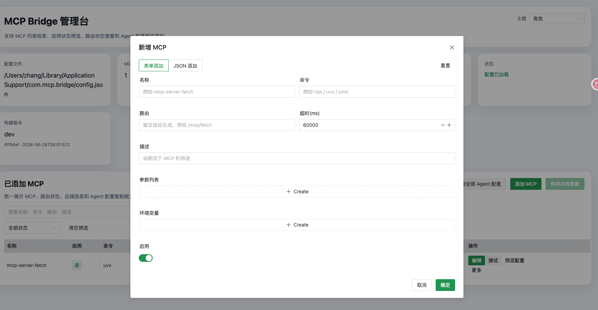

# MCP Bridge

把本地 `stdio` MCP 服务桥接成可直接给 Agent 使用的 `Streamable HTTP` MCP 服务，并提供一个内嵌到二进制里的 Web 管理台。



## 它能做什么

- 用一个 JSON 配置文件管理多个本地 MCP 服务
- 通过单个 HTTP 端口暴露多个 MCP 路由
- 每个后端进程常驻复用，不会每个请求都重新拉起
- 支持管理台查看、编辑、测试、启停和复制 Agent 配置
- 修改 MCP 配置后可热更新，无需重启整个服务

## 适合什么场景

- 你已经有多个本地 `stdio` MCP server，想统一转换成 HTTP 入口
- 你希望给不同 Agent 或工具提供稳定的 MCP URL
- 你不想手改大段 JSON，希望通过可视化页面维护配置

## 快速开始

### 1. 准备配置文件

复制一份示例配置：

```bash
cp config.example.json config.json
```

然后按你的实际 MCP 命令修改 `config.json`。

### 2. 启动服务

如果你已经有编译好的二进制：

```bash
./mcp-bridge -config ./config.json -listen :8082
```

开发阶段也可以直接运行：

```bash
go run ./cmd/mcp-bridge -config ./config.json -listen :8082
```

### 3. 打开管理台

启动后访问：

- 管理台：`http://127.0.0.1:8082/_admin/`
- 健康检查：`http://127.0.0.1:8082/healthz`

## 配置格式

配置文件的核心结构如下：

```json
{
  "mcpServers": {
    "filesystem": {
      "enabled": true,
      "command": "npx",
      "args": ["-y", "@modelcontextprotocol/server-filesystem", "/tmp"],
      "env": {
        "PYTHONIOENCODING": "utf-8"
      },
      "description": "文件系统 MCP",
      "timeout": 60000,
      "path": "/mcp/filesystem"
    }
  }
}
```

说明：

- `enabled`：是否启用该 MCP
- `command`：启动命令
- `args`：命令参数
- `env`：环境变量
- `timeout`：启动/请求超时，单位毫秒
- `path`：对外暴露的 HTTP 路由，可留空自动生成

如果未指定 `path`，程序会默认在 `/mcp` 下自动生成，例如：

- `filesystem` -> `/mcp/filesystem`
- `mcp-server-fetch` -> `/mcp/mcp-server-fetch`

## 管理台能力

- 表格化展示所有 MCP 配置
- 支持搜索、启用状态筛选、空状态提示
- 支持弹窗新增、编辑、复制新增
- 支持表单模式和 JSON 模式录入
- 支持测试某个 MCP 是否能成功初始化
- 支持预览并复制可直接添加到 Agent 的 MCP JSON 配置
- 支持亮色、暗黑、跟随系统三种主题

## 对外接口

- `/`：返回当前路由元信息
- `/healthz`：返回服务和路由健康状态
- `/_admin/`：管理台页面
- `/_admin/api/config`：读取或保存配置
- `/mcp/<route>`：实际对外提供的 Streamable HTTP MCP 入口

## 热更新说明

- 在管理台点击保存后，会重写配置文件并热更新 MCP 路由
- MCP 配置变更通常无需重启服务
- 监听端口变更仍然需要重启进程

## 获取产物

项目提供一键打包脚本：

```bash
./scripts/package-all.sh
```

打包完成后，产物位于 `release/` 目录。

## 更多文档

- [示例配置](./config.example.json)
- [开发与构建指南](./DEVELOPMENT.md)
